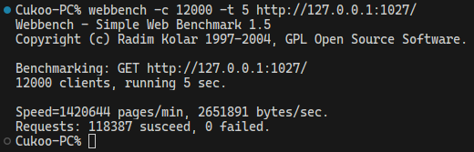

# WebServer

本项目为使用现代 C++ 实现的轻量级 Linux 高性能 Web 服务器，经过 WebBench 压力测试，可支持上万的并发连接数据交换。

## 核心功能与技术

- 使用 **epoll（ET）I/O 复用技术** 、**线程池**、**Reactor 事件处理模式**实现高并发模型
- 使用**状态机**和**正则表达式**解析 HTTP 请求报文，支持解析 **GET** 和 **POST** 请求，支持请求大型文件（如图片和视频等）
- 基于**小根堆**实现定时器容器，支持定时关闭不活跃连接
- 基于 `std::vector<char>` 实现**按需自动扩容的缓冲区**，提高内存空间使用率
- 通过访问数据库实现用户**注册**和**登录**功能，并使用**单例模式**实现**数据库连接池**，减少数据库连接建立与关闭的开销
- 使用 **RAII** 封装资源分配和释放操作，防止资源泄露

## 环境依赖

- Linux
- C++17
- MySQL
- [spdlog](https://github.com/gabime/spdlog)
- [fmt](https://github.com/fmtlib/fmt)

## 快速运行

- 安装环境依赖
- 配置数据库
  
  ```sql
  // 创建 webserver 数据库
  create database webserver;

  // 创建 user 表
  USE webserver;
  CREATE TABLE user(
    username char(50) NULL,
    password char(50) NULL
  )ENGINE=InnoDB;
  
  // 添加用户记录
  INSERT INTO user(username, password) VALUES('username', 'password');
  ```
  
- 修改项目配置信息（`src/config/config.h`）
- 构建与运行
  
  ```shell
  cd ./src
  cmake . -B ../build
  cd ../build
  make
  ./webserver
  ```

## 压力测试

- 测试环境
  - 操作系统: Arch Linux
  - CPU: R7-7735H
  - 内存: 32G
- 测试结果
  - 并发连接总数: 12000
  - 访问服务器时间: 5s
  - 所有访问均成功



## 致谢

Linux高性能服务器编程，游双著.

[@markparticle](https://github.com/markparticle/WebServer)
