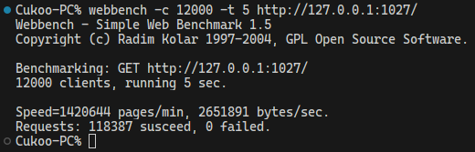

# WebServer

使用C++实现的高性能web服务器，经过webbench压力测试，可支持上万的并发访问。

## 核心功能与技术

- 使用epoll（ET模式）、线程池、模拟Proactor模式实现高并发模型
- 使用状态机解析HTTP请求报文，支持解析GET和POST请求，可以请求图片和视频文件
- 基于小根堆实现定时器容器，支持定时关闭非活动连接
- 通过访问数据库实现用户注册、登录功能，并使用单例模式实现数据库连接池，减少数据库连接建立与关闭的开销
- 使用RAII手法封装数据库连接、互斥锁、信号量等资源

## 压力测试

- 测试环境
  - 操作系统: Arch Linux
  - CPU: R7-7735H
  - 内存: 32G
- 测试结果
  - 并发连接总数: 12000
  - 访问服务器时间: 5s
  - 所有访问均成功

## 致谢

Linux高性能服务器编程，游双著.

[@qinguoyi](https://github.com/qinguoyi/TinyWebServer)